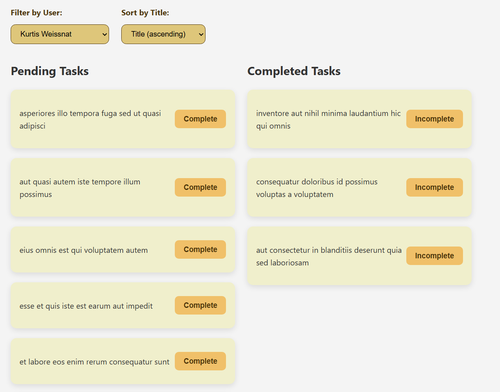

# ToDo List App

This project is a basic ToDo list app that allows users to view tasks, mark them as complete or incomplete, apply filters, and sort them. It retrieves task data from the API at jsonplaceholder.typicode.com.

This project was bootstrapped with [Create React App](https://github.com/facebook/create-react-app).

## Built With

- React 19.1.0  
- React DOM 19.1.0  
- React Scripts 5.0.1  

## Clone Repository

git clone git@github.com:evaristovska/todo_app_dss.git

## Navigate to prоject directory and install dependencies
cd todo
npm install

## Available Scripts:
In the project directory, you can run:

### `npm start`

Runs the app in the development mode.\
Open [http://localhost:3000](http://localhost:3000) to view it in your browser.